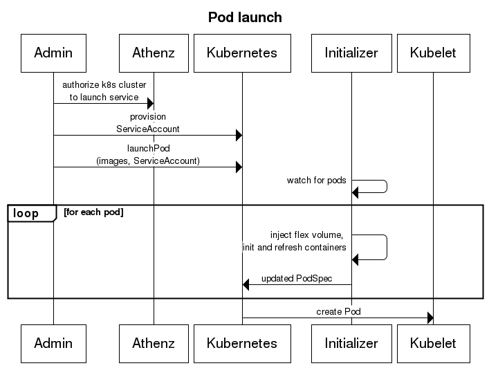
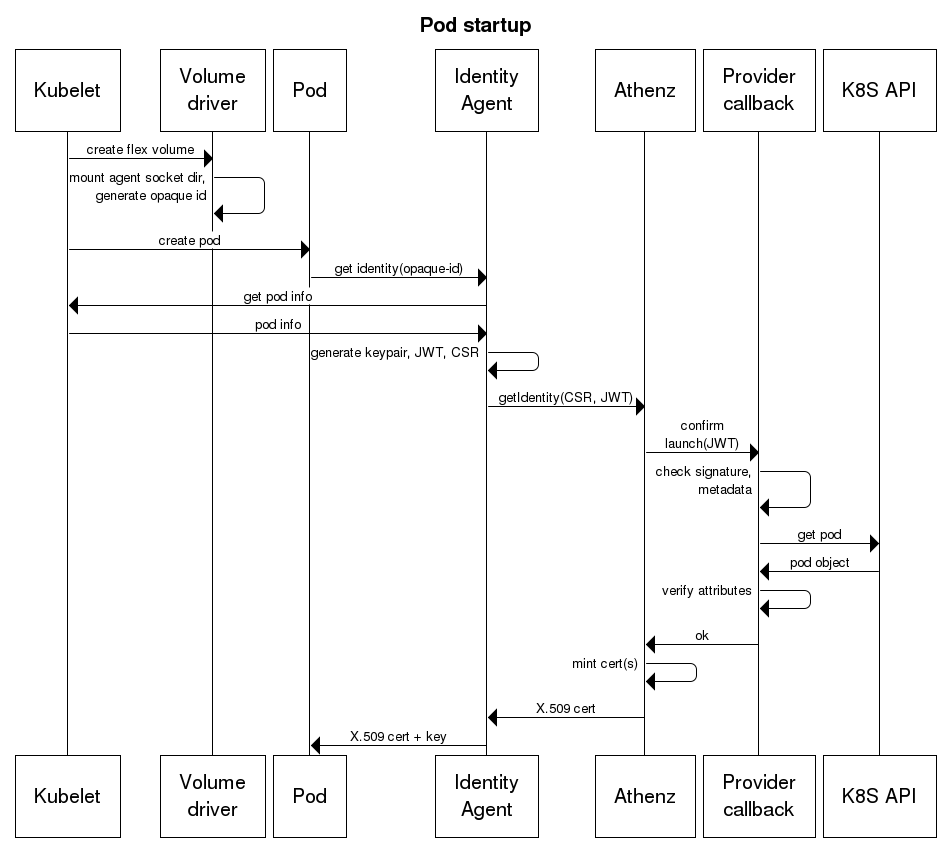

Please read the [Athenz overview doc](ATHENZ.md) first.


### Service identity bootstrap

* We assume that every node has ephemeral TLS certs created on boot and refreshed in the background by the provision service
  (e.g. openstack) and a node-agent running on every box. This is outside the scope of kubernetes.
* The k8s identity agent uses these certs to prove its identity.
* Every pod launched on a node is given an identity by the identity agent using the kubelet API as the source of truth.
  * Pods (via init container and sidecars) must request an identity init/ refresh from the local identity agent. The 
    identity agent listens on a Unix domain socket that is mounted into the pod sidecar/ init container via a flex volume.
  * The identity agent in turn collects information about the pod being launched and creates a JWT representing the pod
    identity. 
  * This is forwarded to Athenz which, in turn, calls back on the provider callback endpoint for verification.
  * The provider callback verifies the identity document by comparing it against pod and service information from the 
    K8s API.
* The provider callback is itself a K8s service running on the cluster bootstrapped with an Athenz identity using a
  service key.
* The JWT needs to be signed and verified. There are no keys on the box that can be used to sign documents. This requires
  a signing service that has been loaded with private keys. The corresponding public keys are loaded into the 
  provider callback for verifying JWTs. The identity agent uses the signing service to sign JWTs.
* Mutual TLS ensures that only the components that can allowed to talk to each other can in fact do so.

### Launch flow




### Identity document

The identity document is a JWT that looks as follows. It is completely ephemeral and never written to disk/
environment variables etc.

#### Header

```json
{
  "alg": "RS256",
  "iss": "secret:athenz-init-secret?version=v1",
  "typ": "JWT"
}
```

#### Payload

```json
{
  "aud": "k8s-athenz-identity",
  "exp": 1507101919,
  "iat": 1507101019,
  "iss": "secret:athenz-init-secret?version=v1",
  "sub": "pod:k8s-namespace/k8s-pod-id?d=athenz-domain&n=athenz-service&i=pod-ip"
}
```

### Pod subject

A pod subject encapsulates all attributes that need to be verified for a pod and can be serialized to and
deserialized from a URI. The attributes are:

* Pod namespace and name
* Athenz domain (from namespace) and service name (from the service account)
* Pod IP (from kubelet metadata and API metadata for verification)

