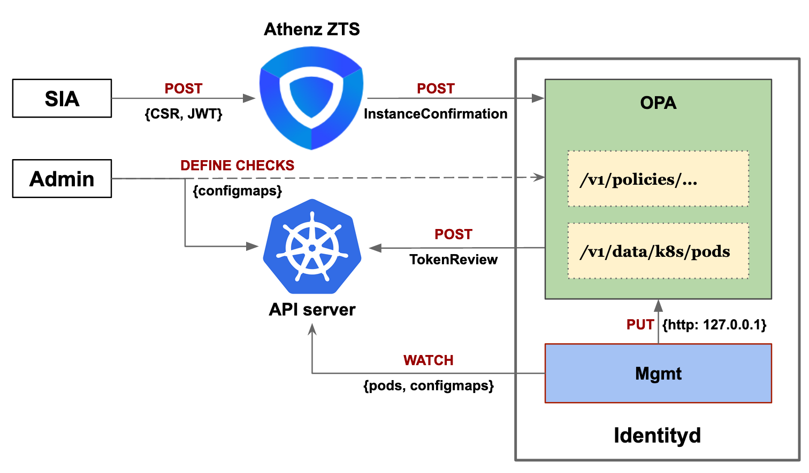

# k8s-athenz-identity
k8s-athenz-identity is a [Kubernetes](https://kubernetes.io/) control plane component
which aims to securely provision unique [Athenz](https://github.com/yahoo/athenz)
identities (X.509 certificates) for pods.

## Background
Kubernetes provides a mechanism for pods to obtain bound service account JWTs issued
by the API server. However, this JWT is not directly useful outside the Kubernetes
cluster. In general, applications require credentials issued by an organization specific
IAM provider to authenticate with external systems. This project aims to provide a way
for pods to exchange service account JWTs with a credential provider for a unique identity.

### Athenz
[Athenz](https://www.athenz.io/) is an IAM provider which allows users to define
role based access control (RBAC) for users and services. It also acts as a certificate
authority (CA) by provisioning instances with unique identities through X.509 certificates.

#### Copper Argos
[Athenz Copper Argos](https://yahoo.github.io/athenz/site/copper_argos_dev/) is a
callback mechanism for identity providers to validate certificate requests from
instances running in a variety of platforms such as Kubernetes pods, openstack vms,
AWS EC2s, etc. This allows any orchestration layer to implement platform specific
instance verification checks.

## Architecture
The architecture section dives into the details of the various components built
to create an Athenz Copper Argos identity provider.



### SIA
Service Identity Agent (SIA) is a container which is bundled as a sidecar for an
application pod. It is primarily responsible for creating a CSR for the application
and requesting a certificate from Athenz ZTS. SIA is mounted with a bound Kubernetes
service account JWT issued with an audience specific to the identity provider,
"athenz-identityd" (can be the Athenz service of identity provider).

These are the steps the SIA container follows to retrieve an identity:
1. Creates a new private key and signs a CSR with the subject common name as
"athenz-domain.athenz-service", required SANs, etc.
2. Constructs an Athenz InstanceRegisterInformation object with the CSR and the
bound service account JWT as attestation data.
3. Makes a request to ZTS to the postInstanceRegister API call.
4. ZTS forwards the attestation data and CSR details to the identity provider
for validation.
5. Certificate is minted by Athenz ZTS and returned to the SIA container.
6. SIA writes the certificates to a directory for the application to consume.

### Identity Provider
Identity provider is an Athenz Copper Argos callback provider which validates
requests for new identities. It runs as a deployment in the cluster and has an
in-memory cache of all running pods.

These are the steps the Identity provider follows to validate an identity:
1. Validate the bound service account JWT of the attestation data is valid, this
involves either making a request to the Kubernetes TokenReview API or using public
key validation.
2. Validate the pod which is requesting the identity is actually running within the
cluster.
3. Validate the CSR details including IP, SANS, common name, etc.

The checks are implemented as rego policies evaluated by an OPA server.

#### Using Open Policy Agent (OPA) for the Identity Provider
[OPA](https://www.openpolicyagent.org/docs/latest/kubernetes-introduction/) provides
a policy evaluation engine and a Rego language to write the policies. The most common
use case of OPA in Kubernetes is for admission control where the checks are written as
rego policies and loaded to OPA through configmaps. If the admission checks require to
lookup any kubernetes object, OPA provides replication (cache) setup for cluster
& namespace scoped resources. This replication mechanism also allows updating policy
checks dynamically.

The idea is to run the identity provider pod as an OPA instance and define the
identity verification checks as Rego policies written in configmaps. OPA’s rego
evaluation engine also has built-in support for JWT verification and making HTTP
requests. This helps us to verify the attestation data JWT either by making Kubernetes
API TokenReview requests or by locally validating the signature using the pre-loaded
kubernetes API public key. Other field verifications that depend on the pod metadata
can use the resource replication feature and cache the pod resources. 

The identity provider pod contains two containers:
- **Opa** - Evaluates the identity verification checks with information provided with
from the policy configmaps and replicated pods resource information
- **Mgmt** - Fetches the configmap policies from the configured system namespace and the
cluster pod resources by watching the Kubernetes API and storing them on OPA through
localhost REST API calls.

## Getting Started

### Prerequisites
There are a couple of prerequisites required to run this identity provider, they are
specified below.
- **Kubernetes cluster** - A running Kubernetes cluster, version 1.13 or higher, is
required with admin access. More information on how to setup a cluster can be found
in the official documentation [here](https://kubernetes.io/docs/setup/).
- **Athenz** - A complete Athenz setup including [ZMS](https://yahoo.github.io/athenz/site/setup_zms_prod/), 
[ZTS](https://yahoo.github.io/athenz/site/setup_zts_prod/), and an optional
[UI](https://yahoo.github.io/athenz/site/setup_ui_prod/) server installed.

### Setup
1. Clone the repository and use kubectl to create the [RBAC](k8s/rbac.yaml), and
the Identity provider [deployment and service](k8s/identityd.yaml)

    ```
    git clone https://github.com/yahoo/k8s-athenz-identity.git
    kubectl apply -f k8s-athenz-identity/k8s
    ```

2. Create an Athenz domain and a service using [zms-cli](https://github.com/yahoo/athenz/tree/master/utils/zms-cli)
or ZMS UI corresponding to the Identityd k8s service

    ```
    # Build the zms-cli utility to interact with the Athenz ZMS server
    go get https://github.com/yahoo/athenz/tree/master/utils/zms-cli
    
    # Create an Athenz domain associated with the Kubernetes cluster
    zms-cli add-domain k8s-cluster-name 
    
    # Create an Athenz service on the cluster domain to associate it with the Identityd Kubernetes service 
    zms-cli -d k8s-cluster-name add-service identityd
    
    # Set the Identityd service endpoint to point to the kubernetes identityd service
    zms-cli -d k8s-cluster-name set-service-endpoint identityd identityd.default.svc.cluster.local
    ``` 

### Usage
1. The application deployments that require Athenz identity certs need the SIA container
and the kubernetes bound service account JWT volume mount added to the pod template
using the sample [patch](k8s/patch/sia.json)

    ```
    kubectl patch deploy <app.yaml> -p "$(k8s/patch/sia.json)"
    ``` 

The generated Athenz cert and key is stored under the `tls-certs` volume mount.

## Contribute
Please refer to the [contributing](Contributing.md) file for information about
how to get involved. We welcome issues, questions, and pull requests.

## Maintainers/Contacts
Core Team : omega-core@verizonmedia.com

## License
Copyright 2019 Verizon Media Inc. Licensed under the terms of the 3-Clause BSD License.
