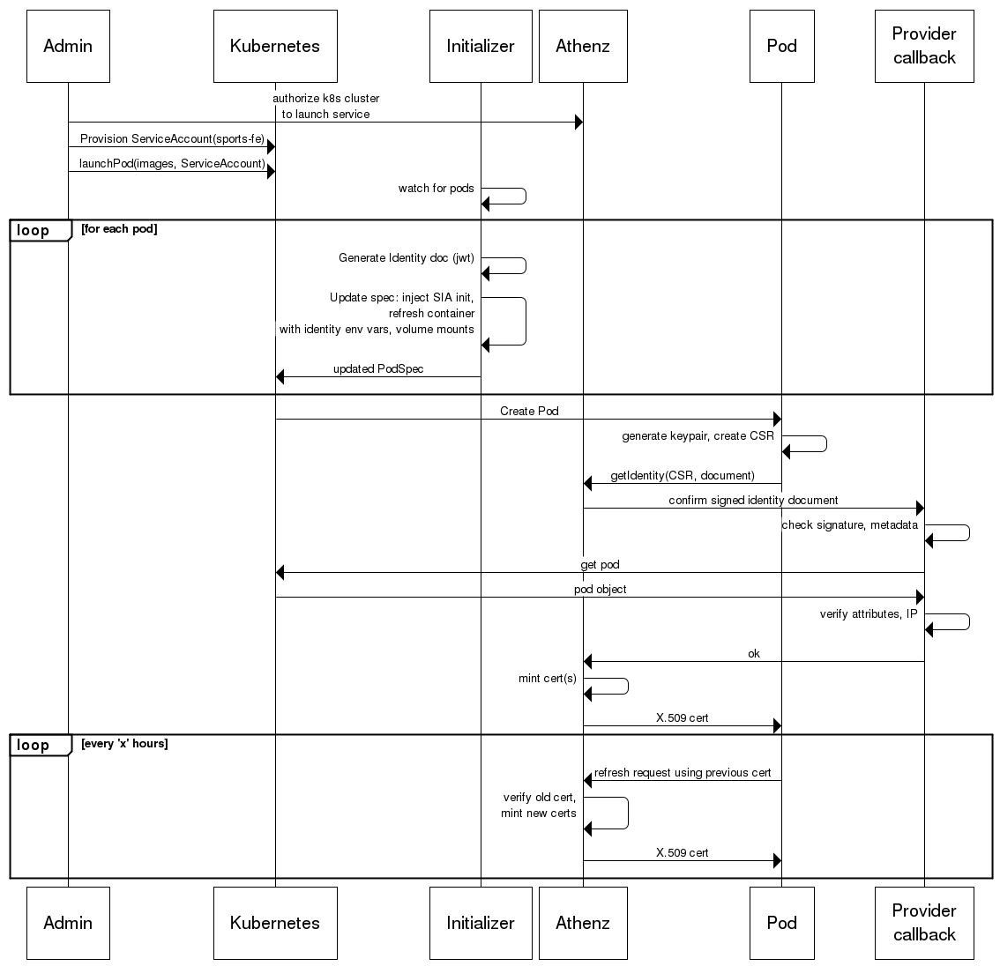

Launch flow
===========



Actors
----

* _Admin_: human who authorizes an Athenz service to be launched on the k8s cluster and provisions its service account.
* _Kubernetes_: Umbrella term for the k8s API and its control plane components
* _Initializer_: the k8s initializer watching for pod launches. Runs as a deployment on the cluster. Has versioned
  signing secrets for generating JWTs.
* _Athenz_: Umbrella term for ZMS + ZTS. ZTS is the component that participates in the launch. Deployed outside the 
  cluster.
* _Pod_: the pod that is being launched. Calls from the pod originate from the sidecars injected into it. The sidecar
  runs as an init container for the initial cert fetch as well as a regular container for refreshing credentials.
* _Provider callback_: endpoint that is accessed by Athenz to verify identity documents. Runs as a service on the 
  cluster. It needs TLS certs signed by Athenz in order for it to be trusted. This is gotten using the control plane 
  identity agent running in a sidecar.

Identity document
-----

The identity document is a JWT that looks as follows:

### Header

```json
{
  "alg": "RS256",
  "iss": "secret:athens-init-secret?version=v1",
  "typ": "JWT"
}
```

### Payload

```json
{
  "aud": "k8s-athenz-identity",
  "exp": 1507101919,
  "iat": 1507101019,
  "iss": "secret:athens-init-secret?version=v1",
  "sub": "pod:k8s-namespace/k8s-pod-id?d=athenz-domain&s=athenz-service"
}
```
